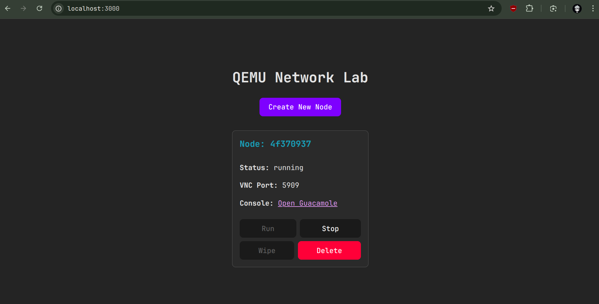
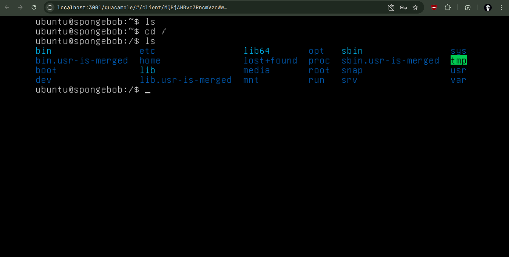

# Network Lab - QEMU Virtual Machine Manager

A full-stack web application for managing KVM/QEMU virtual machines with integrated remote desktop access via Apache Guacamole. This project provides an intuitive interface to create, manage, and access Ubuntu-based virtual machines through your browser.





## Overview

Network Lab is a containerized platform that enables users to:
- Spin up isolated Ubuntu virtual machines on-demand
- Access VM consoles directly through a web browser using Apache Guacamole
- Manage VM lifecycle (create, start, stop, wipe, delete)
- Leverage QEMU's KVM acceleration for near-native performance
- Persist VM state using QCOW2 overlay disks

## Features

### VM Management
- **Create VMs**: Instantly create new virtual machine instances based on a pre-configured Ubuntu base image
- **Start/Stop**: Control VM lifecycle with simple API calls or UI buttons
- **Wipe**: Reset a VM to its initial state while preserving its identity
- **Delete**: Permanently remove VMs and associated resources

### Remote Access
- **Browser-based Console**: Access VM consoles through Apache Guacamole's VNC viewer
- **No Client Software**: Zero additional software installation required on client machines
- **Automatic Connection Management**: VNC connections are automatically created and destroyed with VM lifecycle

### Resource Management
- **Port Pool Management**: Intelligent VNC port allocation from a configurable pool (5900-5920)
- **Process Monitoring**: Automatic detection and cleanup of stale VM processes
- **Persistent State**: VM state persists across backend restarts using JSON-based state management

### Cloud-Init Integration
- **Automated Configuration**: VMs are configured automatically on first boot using cloud-init
- **Default Credentials**: Pre-configured user (`ubuntu`/`ubuntu`) for immediate access
- **Customizable**: Easy to modify user-data and meta-data for custom configurations


### Components

1. **Frontend (React + Vite)**
   - Modern React 19 UI with real-time VM status updates
   - Polls backend every 5 seconds for state changes
   - Responsive interface for VM management operations

2. **Backend (FastAPI)**
   - RESTful API for VM lifecycle management
   - QEMU process management and monitoring
   - Integration with Guacamole API for connection management
   - Persistent state management using JSON storage

3. **Apache Guacamole**
   - Clientless remote desktop gateway
   - Provides browser-based VNC access to VMs
   - Backed by PostgreSQL for connection metadata

4. **guacd**
   - Guacamole proxy daemon
   - Handles actual VNC protocol communication

5. **PostgreSQL**
   - Stores Guacamole connection and user data

6. **QEMU/KVM**
   - Virtual machine hypervisor
   - Runs Ubuntu VMs with KVM hardware acceleration
   - Uses QCOW2 overlay images for efficient disk management

## Installation

### 1. Clone the Repository
```bash
git clone https://github.com/sponge-24/network-lab.git
cd network-lab
```

### 2. Prepare the Base Image
Place your Ubuntu base image in the `images/` directory:
```bash
# Download Ubuntu cloud image (example)
cd images
wget https://cloud-images.ubuntu.com/minimal/releases/noble/release/ubuntu-24.04-minimal-cloudimg-amd64.img
mv minimal-cloudimg-amd64.img base.qcow2

# Or create your own custom base image
# Ensure it's in QCOW2 format and cloud-init compatible
```

### 3. Initialize Guacamole Database
Initialize the PostgreSQL database for Guacamole:
```bash
# Start PostgreSQL
docker compose up -d postgres

# Initialize Guacamole schema
docker run --rm guacamole/guacamole /opt/guacamole/bin/initdb.sh --postgresql |   docker exec -i guac-postgres psql -U guacamole_user -d guacamole_db

```

### 4. Build and Start Services
```bash
# Build and start all services
docker compose up -d

# View logs
docker compose logs -f

# Check service status
docker compose ps
```

### 5. Verify Installation
- Frontend: http://localhost:3000
- Backend API: http://localhost:8000/docs (Swagger UI)
- Guacamole: http://localhost:3001/guacamole (admin/admin)

## 📖 Usage

### Web Interface

1. **Access the Frontend**
   - Navigate to http://localhost:3000
   - You'll see the Network Lab dashboard

2. **Create a New VM**
   - Click "Create New Node"
   - A new stopped VM will appear with a unique ID

3. **Start a VM**
   - Click "Run" on any stopped VM
   - Wait a few seconds for the VM to start
   - A "Open Guacamole" link will appear

4. **Access VM Console**
   - Click "Open Guacamole" 
   - Login to Guacamole (default: guacadmin/guacadmin)
   - You'll see the VM's VNC console
   - Login to Ubuntu VM (default: ubuntu/ubuntu)

5. **Stop a VM**
   - Click "Stop" to gracefully shut down the VM
   - VNC connection is automatically removed

6. **Wipe a VM**
   - Click "Wipe" to reset VM to initial state
   - Useful for lab resets or cleanup

7. **Delete a VM**
   - Click "Delete" to permanently remove the VM
   - Confirmation dialog will appear

### API Usage

#### List All Nodes
```bash
curl http://localhost:8000/nodes
```

#### Create a New Node
```bash
curl -X POST http://localhost:8000/nodes
```

#### Start a Node
```bash
curl -X POST http://localhost:8000/nodes/{node_id}/run
```

#### Stop a Node
```bash
curl -X POST http://localhost:8000/nodes/{node_id}/stop
```

#### Wipe a Node
```bash
curl -X POST http://localhost:8000/nodes/{node_id}/wipe
```

#### Delete a Node
```bash
curl -X DELETE http://localhost:8000/nodes/{node_id}
```

## API Reference

### Endpoints

| Method | Endpoint | Description | 
|--------|----------|-------------|
| GET | `/nodes` | List all nodes | 
| POST | `/nodes` | Create a new node | 
| POST | `/nodes/{node_id}/run` | Start a node | 
| POST | `/nodes/{node_id}/stop` | Stop a node | 
| POST | `/nodes/{node_id}/wipe` | Wipe and reset a node | 
| DELETE | `/nodes/{node_id}` | Delete a node |

### Node Object Schema

```json
{
  "id": "550e8400-e29b-41d4-a716-446655440000",
  "status": "running",
  "vnc_port": 5900,
  "guac_conn_id": "12",
  "guac_url": "http://localhost:3001/guacamole/#/client/..."
}
```

### Status Values
- `stopped`: VM is not running
- `running`: VM is active and accessible

## Configuration

### Backend Configuration
Edit `backend/core/config.py`:

```python
# Base image location
BASE_IMAGE_PATH = "/app/images/base.qcow2"

# Overlay storage directory
OVERLAY_DIR = "/app/overlays"

# Guacamole connection
GUACAMOLE_URL = "http://guacamole:8080/guacamole"
GUAC_USERNAME = "guacadmin"
GUAC_PASSWORD = "guacadmin"

# VNC port range (20 ports = max 20 concurrent VMs)
VNC_PORT_POOL = list(range(5900, 5921))
```

### VM Resources
Edit `backend/core/vm_manager.py`:

```python
qemu_cmd = [
    "qemu-system-x86_64",
    "-cpu", "host",
    "-machine", "type=q35,accel=kvm",
    "-m", "2048",  # RAM in MB - adjust as needed
    # ... other settings
]
```

### Cloud-Init Customization
Edit `backend/core/vm_manager.py`:

```python
USER_DATA_YAML = """#cloud-config
ssh_pwauth: True
chpasswd:
  expire: false
  list: |
    ubuntu:ubuntu  # Change default password
users:
  - name: ubuntu
    groups: sudo
    shell: /bin/bash
    # Add SSH keys, additional packages, etc.
"""
```

### Docker Compose
Edit `docker-compose.yml` for:
- Port mappings
- Volume mounts
- Resource limits
- Database credentials (Change default passwords!)


## 🛠️ Technologies Used

### Backend
- **FastAPI**: Modern, fast web framework for building APIs
- **Python 3.10+**: Core programming language
- **QEMU/KVM**: Virtualization and VM management
- **cloud-init**: VM initial configuration
- **Requests**: HTTP client for Guacamole API
- **Pydantic**: Data validation and settings management

### Frontend
- **React 19**: UI library for building interactive interfaces
- **Vite**: Fast build tool and development server
- **JavaScript (ES6+)**: Frontend programming language
- **CSS3**: Styling and layout

### Infrastructure
- **Docker & Docker Compose**: Containerization and orchestration
- **Apache Guacamole**: Clientless remote desktop gateway
- **guacd**: Guacamole proxy daemon
- **PostgreSQL 15**: Relational database for Guacamole
- **Nginx** (via Vite): Development server


## Contributing

Contributions are welcome! Please feel free to submit a Pull Request.

### Development Setup

1. Fork the repository
2. Create a feature branch
3. Make your changes
4. Test thoroughly
5. Submit a pull request


## License

This project is licensed under the MIT License - see the [LICENSE](LICENSE) file for details.

---
